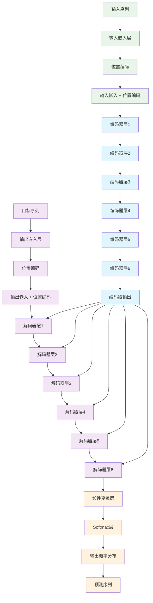
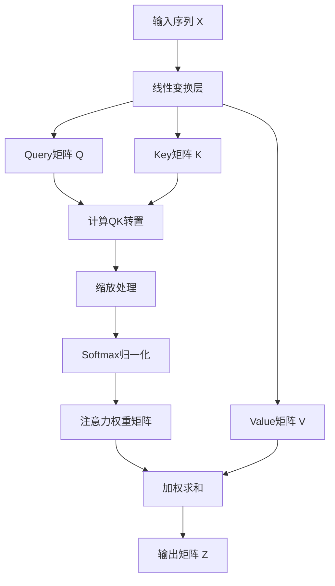
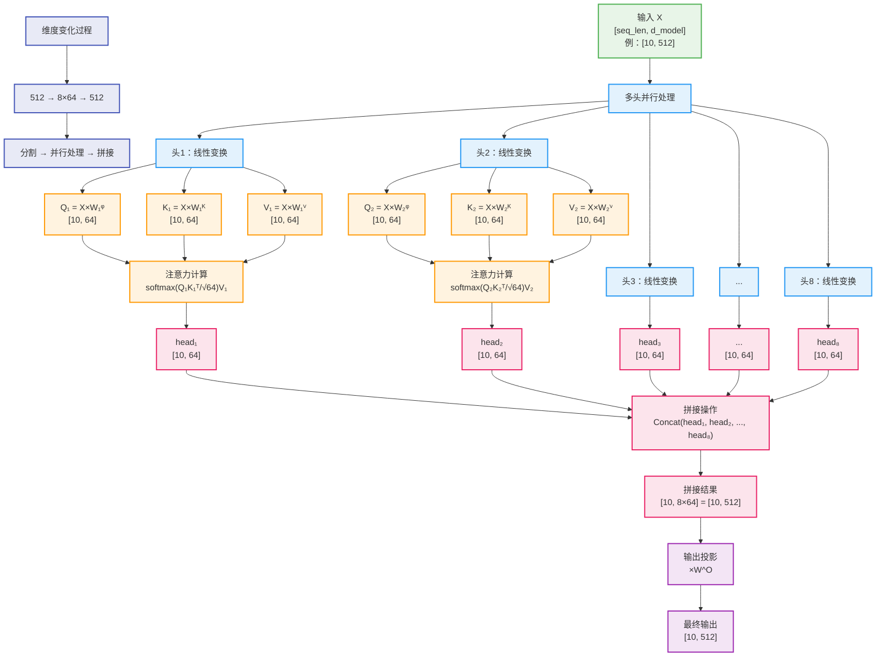
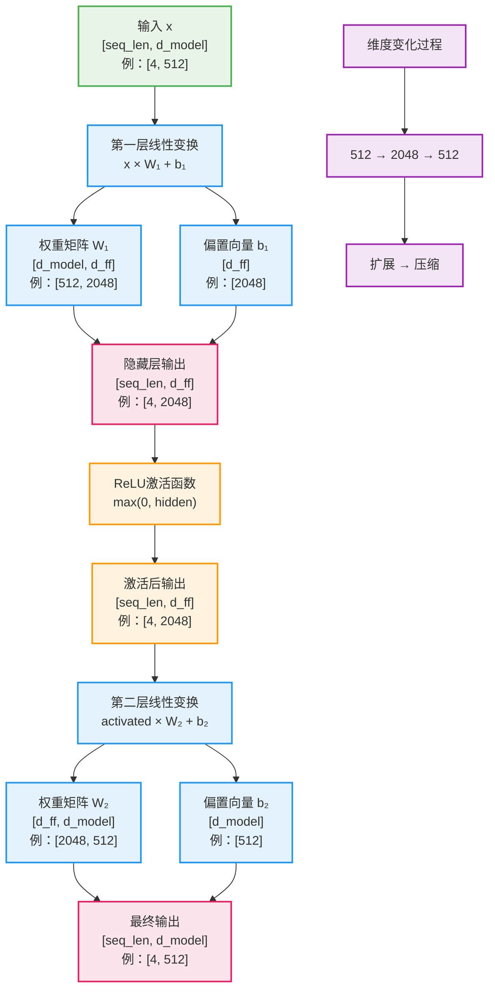
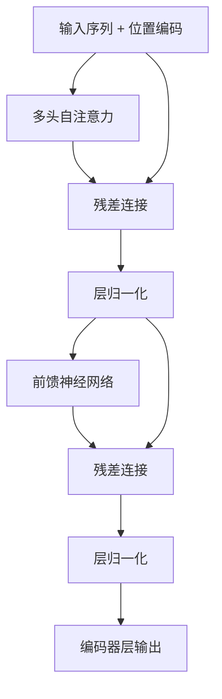
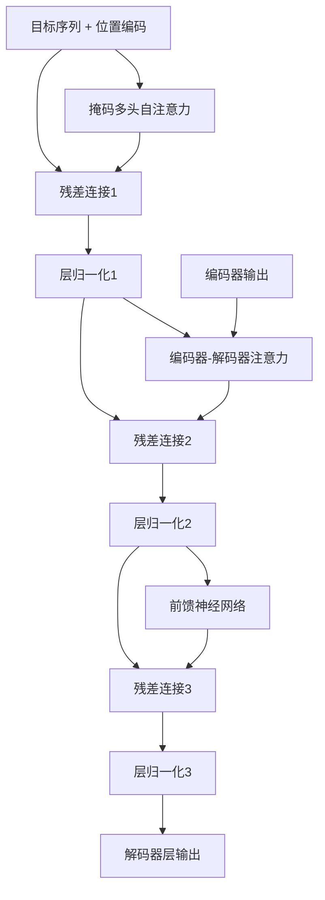

# Transformer学习

**Transformer**是由Google在2017年提出的一种基于自注意力机制的神经网络架构，彻底改变了自然语言处理领域，成为了现代大语言模型的基础架构。

## 目录
- [1. Transformer概述](#1-transformer概述)
- [2. 核心创新](#2-核心创新)
- [3. 整体架构](#3-整体架构)
- [4. 输入嵌入层和位置编码](#4-输入嵌入层和位置编码)
- [5. 自注意力机制](#5-自注意力机制)
- [6. 多头注意力](#6-多头注意力)
- [7. 前馈神经网络](#7-前馈神经网络)
- [8. 编码器（Encoder）](#8-编码器encoder)
- [9. 解码器（Decoder）](#9-解码器decoder)
- [10. 位置编码](#10-位置编码)
- [11. 残差连接和层归一化](#11-残差连接和层归一化)
- [12. Transformer变体](#12-transformer变体)
- [13. 应用场景](#13-应用场景)
- [14. 优缺点分析](#14-优缺点分析)
- [15. 学习资源](#15-学习资源)

## 1. Transformer概述

### 1.1 背景
在Transformer出现之前，序列到序列（Seq2Seq）任务主要依赖于：
- **RNN/LSTM**：处理序列数据，但存在梯度消失和并行化困难
- **CNN**：可以并行化，但难以捕获长距离依赖
- **注意力机制**：作为RNN的补充，提高长序列处理能力

### 1.2 Transformer的突破
- **完全基于注意力**：摒弃了RNN和CNN
- **并行化训练**：大幅提升训练效率
- **长距离依赖**：有效捕获序列中的长距离关系
- **可扩展性**：为大规模模型奠定基础

## 2. 核心创新

Transformer引入了三个关键创新，彻底改变了序列建模的方式：

### 2.1 位置编码（Positional Encoding）
- 解决注意力机制无法感知位置信息的问题
- 使用正弦和余弦函数编码，支持任意长度序列
- 详见 [第4章 输入嵌入层和位置编码](#4-输入嵌入层和位置编码)

### 2.2 自注意力机制（Self-Attention）
- 允许序列中的每个位置关注到所有其他位置
- 实现并行化计算，直接建模长距离依赖关系
- 详见 [第5章 自注意力机制](#5-自注意力机制)

### 2.3 多头注意力（Multi-Head Attention）
- 并行运行多个注意力头，捕获不同类型的关系和模式
- 增强模型的表达能力和特征提取能力
- 详见 [第6章 多头注意力](#6-多头注意力)

## 3. 整体架构

### 3.1 架构组成
- **编码器栈**：6层编码器层
- **解码器栈**：6层解码器层
- **嵌入层**：将token转换为向量
- **位置编码**：添加位置信息
- **输出层**：生成最终预测

### 3.2 数据流向
1. **输入处理**：Token嵌入 + 位置编码
2. **编码阶段**：通过编码器栈处理输入序列
3. **解码阶段**：解码器利用编码器输出生成目标序列
4. **输出生成**：线性变换 + Softmax

### 3.3 Transformer整体架构流程图



### 3.4 关键组件说明

#### 3.4.1 输入处理
- **输入嵌入**：将词汇转换为d_model维的向量
- **位置编码**：为每个位置添加位置信息
- **相加操作**：嵌入向量与位置编码相加

#### 3.4.2 编码器栈
- **6层堆叠**：每层包含多头自注意力和前馈网络
- **残差连接**：每个子层都有残差连接和层归一化
- **并行处理**：所有位置可以并行计算

#### 3.4.3 解码器栈
- **6层堆叠**：每层包含三个子层
- **掩码注意力**：防止看到未来信息
- **编码器-解码器注意力**：关注输入序列
- **自回归生成**：逐步生成输出序列

#### 3.4.4 输出处理
- **线性变换**：将隐藏状态映射到词汇表大小
- **Softmax**：转换为概率分布
- **预测**：选择概率最高的词汇

## 4. 输入嵌入层和位置编码

### 4.1 输入嵌入层（Input Embedding）

#### 4.1.1 基本原理
输入嵌入层将离散的词汇标记（tokens）转换为连续的向量表示，这是神经网络能够处理文本数据的基础。

#### 4.1.2 数学表示
**嵌入矩阵：**
```
E ∈ R^(V × d_model)
```

**嵌入查找：**
```
embedding(token_id) = E[token_id, :]
```

**参数说明：**
- **V**：词汇表大小（如30,000或50,000）
- **d_model**：模型维度（如512或768）
- **token_id**：词汇在词汇表中的索引
- **E**：可学习的嵌入矩阵

#### 4.1.3 具体计算过程

**步骤1：词汇标记化**
```
输入文本: "Hello world"
标记化后: ["Hello", "world"]
词汇ID: [1234, 5678]
```

**步骤2：嵌入查找**
```
嵌入矩阵E: [V, d_model] = [30000, 512]
token_1234的嵌入: E[1234, :] → [512维向量]
token_5678的嵌入: E[5678, :] → [512维向量]
```

**步骤3：序列嵌入**
```
输入序列: [token_1, token_2, ..., token_n]
嵌入序列: [emb_1, emb_2, ..., emb_n]
维度: [seq_len, d_model]
```

#### 4.1.4 嵌入缩放
在Transformer中，嵌入向量通常会乘以√d_model进行缩放：

```
scaled_embedding = embedding × √d_model
```

**缩放原因：**
- **数值稳定性**：防止嵌入值过小
- **梯度平衡**：与位置编码的数值范围匹配
- **训练稳定**：改善训练初期的梯度流动

#### 4.1.5 嵌入层特点
- **共享权重**：编码器和解码器可以共享嵌入矩阵
- **可学习参数**：通过反向传播更新嵌入向量
- **语义表示**：相似词汇的嵌入向量在空间中更接近
- **维度固定**：所有词汇都映射到相同维度的向量空间

### 4.2 位置编码（Positional Encoding）

#### 4.2.1 为什么需要位置编码

**注意力机制的位置无关性：**
- 自注意力机制本身是**排列不变**的
- 改变输入序列的顺序不会影响注意力计算结果
- 但语言理解需要位置信息（"我爱你"vs"你爱我"）

**解决方案：**
显式地为每个位置添加位置信息，使模型能够区分不同位置的词汇。

#### 4.2.2 正弦位置编码

Transformer使用正弦和余弦函数来生成位置编码：

**数学公式：**
```
PE(pos, 2i) = sin(pos / 10000^(2i/d_model))
PE(pos, 2i+1) = cos(pos / 10000^(2i/d_model))
```

**参数说明：**
- **pos**：位置索引（0, 1, 2, ...）
- **i**：维度索引（0, 1, 2, ..., d_model/2-1）
- **2i**：偶数维度使用sin函数
- **2i+1**：奇数维度使用cos函数
- **10000**：基础频率参数

#### 4.2.3 位置编码计算示例

假设d_model=512，计算位置0和位置1的编码：

**位置0的编码：**
```
PE(0, 0) = sin(0 / 10000^(0/512)) = sin(0) = 0
PE(0, 1) = cos(0 / 10000^(0/512)) = cos(0) = 1
PE(0, 2) = sin(0 / 10000^(2/512)) = sin(0) = 0
PE(0, 3) = cos(0 / 10000^(2/512)) = cos(0) = 1
...
```

**位置1的编码：**
```
PE(1, 0) = sin(1 / 10000^(0/512)) = sin(1) ≈ 0.841
PE(1, 1) = cos(1 / 10000^(0/512)) = cos(1) ≈ 0.540
PE(1, 2) = sin(1 / 10000^(2/512)) ≈ sin(0.9999) ≈ 0.841
PE(1, 3) = cos(1 / 10000^(2/512)) ≈ cos(0.9999) ≈ 0.540
...
```

#### 4.2.4 位置编码的优势

**1. 确定性**
- 相同位置总是产生相同的编码
- 不需要学习，减少参数量
- 训练和推理时保持一致

**2. 相对位置感知**
- 模型可以学习相对位置关系
- PE(pos+k)可以表示为PE(pos)的线性组合
- 支持位置之间的数学关系

**3. 外推性**
- 可以处理比训练时更长的序列
- 位置编码的模式是周期性的
- 不受序列长度限制

**4. 平滑性**
- 相邻位置的编码相似
- 远距离位置的编码差异较大
- 提供了良好的位置梯度

#### 4.2.5 位置编码可视化

不同维度的位置编码具有不同的频率：
- **低维度**：变化缓慢，捕获长距离模式
- **高维度**：变化快速，捕获短距离模式
- **组合效果**：提供丰富的位置表示

### 4.3 嵌入与位置编码的结合

#### 4.3.1 相加操作
```
final_input = input_embedding + positional_encoding
```

**维度要求：**
- input_embedding: [seq_len, d_model]
- positional_encoding: [seq_len, d_model]
- final_input: [seq_len, d_model]

#### 4.3.2 为什么使用相加而不是拼接

**相加的优势：**
- **维度保持**：不增加模型维度
- **参数效率**：不需要额外的线性层
- **信息融合**：嵌入和位置信息自然融合
- **计算效率**：简单的元素级加法

**拼接的缺点：**
- **维度增加**：需要2×d_model的维度
- **参数增加**：后续层需要更多参数
- **计算开销**：更大的矩阵运算

#### 4.3.3 完整输入处理流程

```
1. 文本标记化: "Hello world" → [1234, 5678]
2. 嵌入查找: [1234, 5678] → [[emb_1], [emb_2]]
3. 嵌入缩放: [[emb_1], [emb_2]] × √d_model
4. 位置编码: 生成 [[PE_0], [PE_1]]
5. 相加融合: [[emb_1 + PE_0], [emb_2 + PE_1]]
6. 输入编码器: 最终的输入表示
```

### 4.4 实现考虑

#### 4.4.1 嵌入层优化
- **词汇表大小**：平衡覆盖率和效率
- **嵌入维度**：通常等于d_model
- **初始化策略**：使用适当的初始化方法
- **权重共享**：输入和输出嵌入可以共享

#### 4.4.2 位置编码变体
- **学习式位置编码**：可学习的位置嵌入
- **相对位置编码**：关注相对而非绝对位置
- **旋转位置编码（RoPE）**：更新的位置编码方法
- **ALiBi**：注意力偏置的位置编码

#### 4.4.3 长序列处理
- **截断策略**：处理超长序列
- **滑动窗口**：分段处理长文本
- **层次编码**：多层次的位置信息
- **稀疏注意力**：减少长序列的计算复杂度

## 5. 自注意力机制

### 5.1 基本原理
自注意力机制允许序列中的每个元素关注到序列中的所有元素，包括它自己。

### 5.2 数学公式与直观理解
```
Attention(Q, K, V) = softmax(QK^T / √d_k)V
```

**参数说明：**
- **Q（Query）**：查询矩阵
- **K（Key）**：键矩阵  
- **V（Value）**：值矩阵
- **d_k**：键向量的维度

**直观理解：**
- **Query**："我想要什么信息？"
- **Key**："我有什么信息？"
- **Value**："我实际提供的信息"
- **注意力权重**：Query和Key的匹配程度

### 5.3 计算步骤

#### 5.3.1 输入准备
假设我们有一个输入序列 X，其维度为 `[seq_len, d_model]`，其中：
- `seq_len`：序列长度（如句子中的词数）
- `d_model`：模型的隐藏维度（通常为512或768）

#### 4.3.2 线性变换生成Q、K、V

**步骤1：线性变换**
```
Q = X × W_Q    # [seq_len, d_model] × [d_model, d_k] = [seq_len, d_k]
K = X × W_K    # [seq_len, d_model] × [d_model, d_k] = [seq_len, d_k]
V = X × W_V    # [seq_len, d_model] × [d_model, d_v] = [seq_len, d_v]
```

**维度说明：**
- `W_Q, W_K, W_V`：可学习的权重矩阵
- `d_k`：Query和Key的维度，通常等于 `d_model / num_heads`
- `d_v`：Value的维度，通常也等于 `d_model / num_heads`
- 在单头注意力中，`d_k = d_v = d_model`
- 在多头注意力中，`d_k = d_v = d_model / num_heads`

#### 4.3.3 计算注意力分数

**步骤2：计算QK^T**
```
Scores = Q × K^T    # [seq_len, d_k] × [d_k, seq_len] = [seq_len, seq_len]
```

**维度确定原理：**
- Q的维度：`[seq_len, d_k]`
- K^T的维度：`[d_k, seq_len]`（K转置后）
- 结果Scores的维度：`[seq_len, seq_len]`
- 这个矩阵表示序列中每个位置对其他所有位置的注意力分数

#### 4.3.4 缩放处理

**步骤3：缩放**
```
Scaled_Scores = Scores / √d_k    # [seq_len, seq_len]
```

**缩放原因：**
- 当`d_k`较大时，点积的值会变得很大
- 大的点积值会导致softmax函数进入饱和区域
- 缩放因子`√d_k`可以控制方差，保持梯度稳定

#### 4.3.5 Softmax归一化

**步骤4：计算注意力权重**
```
Attention_Weights = softmax(Scaled_Scores)    # [seq_len, seq_len]
```

**特性：**
- 每一行的权重和为1
- 权重值在0到1之间
- 表示每个位置对其他位置的关注程度

#### 4.3.6 加权求和

**步骤5：计算最终输出**
```
Output = Attention_Weights × V    # [seq_len, seq_len] × [seq_len, d_v] = [seq_len, d_v]
```

**维度确定：**
- Attention_Weights：`[seq_len, seq_len]`
- V：`[seq_len, d_v]`
- Output：`[seq_len, d_v]`

#### 4.3.7 完整计算示例

假设我们有一个长度为4的序列，d_model=512，单头注意力：

```
输入 X: [4, 512]
权重矩阵 W_Q, W_K, W_V: [512, 512]

计算过程：
Q = X × W_Q → [4, 512]
K = X × W_K → [4, 512]
V = X × W_V → [4, 512]

Scores = Q × K^T → [4, 4]
Scaled = Scores / √512 → [4, 4]
Weights = softmax(Scaled) → [4, 4]
Output = Weights × V → [4, 512]
```

**关键理解：**
- 输出维度与输入维度相同：`[seq_len, d_model]`
- 中间的注意力权重矩阵是方阵：`[seq_len, seq_len]`
- 这使得每个位置都能关注到序列中的所有位置

### 5.4 自注意力机制流程图



## 6. 多头注意力

### 6.1 基本思想
- 并行运行多个注意力头
- 每个头关注不同的表示子空间
- 捕获不同类型的依赖关系

### 6.2 计算过程
```
MultiHead(Q, K, V) = Concat(head_1, ..., head_h)W^O
其中 head_i = Attention(QW_i^Q, KW_i^K, VW_i^V)
```

### 6.3 多头的作用
- **语法关系**：某些头专注于语法结构
- **语义关系**：某些头关注语义相似性
- **长距离依赖**：某些头捕获远距离关系
- **局部模式**：某些头关注局部模式

### 6.4 详细计算步骤

#### 6.4.1 参数设置
假设我们有以下参数：
- **d_model**：模型维度（如512）
- **h**：注意力头数（如8）
- **d_k = d_v = d_model / h**：每个头的维度（如64）
- **seq_len**：序列长度（如10）

#### 6.4.2 线性变换
对于每个注意力头i，我们有独立的权重矩阵：
```
W_i^Q ∈ R^(d_model × d_k)  # Query权重矩阵
W_i^K ∈ R^(d_model × d_k)  # Key权重矩阵  
W_i^V ∈ R^(d_model × d_v)  # Value权重矩阵
```

#### 6.4.3 单头注意力计算
```
Q_i = X × W_i^Q  # [seq_len, d_model] × [d_model, d_k] = [seq_len, d_k]
K_i = X × W_i^K  # [seq_len, d_model] × [d_model, d_k] = [seq_len, d_k]
V_i = X × W_i^V  # [seq_len, d_model] × [d_model, d_v] = [seq_len, d_v]

head_i = Attention(Q_i, K_i, V_i) = softmax(Q_i K_i^T / √d_k) V_i
```

#### 6.4.4 多头拼接与输出投影
```
MultiHead = Concat(head_1, head_2, ..., head_h)  # [seq_len, h×d_v]
Output = MultiHead × W^O  # [seq_len, h×d_v] × [h×d_v, d_model] = [seq_len, d_model]
```

### 6.5 多头注意力计算流程图



### 6.6 多头注意力的优势

#### 6.6.1 表示子空间多样性
- **不同视角**：每个头关注输入的不同方面
- **特征丰富**：捕获更丰富的特征表示
- **互补信息**：多个头提供互补的信息

#### 6.6.2 并行计算效率
- **并行处理**：所有头可以同时计算
- **计算复杂度**：总体复杂度与单头相同
- **硬件友好**：适合GPU并行计算

#### 6.6.3 模型表达能力
- **参数增加**：更多的参数提供更强的表达能力
- **关系建模**：能够建模复杂的依赖关系
- **泛化能力**：提高模型的泛化性能

### 6.7 实现细节

#### 6.7.1 权重矩阵初始化
```python
# 伪代码示例
for i in range(num_heads):
    W_Q[i] = xavier_uniform(d_model, d_k)
    W_K[i] = xavier_uniform(d_model, d_k) 
    W_V[i] = xavier_uniform(d_model, d_v)
    
W_O = xavier_uniform(num_heads * d_v, d_model)
```

#### 6.7.2 计算优化
- **矩阵重塑**：将多头计算重塑为批量矩阵乘法
- **内存优化**：减少中间结果的内存占用
- **数值稳定性**：注意softmax计算的数值稳定性

## 7. 前馈神经网络

### 7.1 基本结构与数学公式

前馈神经网络（Feed-Forward Network, FFN）是Transformer中每个编码器和解码器层的重要组成部分。

**数学公式：**
```
FFN(x) = max(0, xW_1 + b_1)W_2 + b_2
```

**等价表示：**
```
FFN(x) = ReLU(xW_1 + b_1)W_2 + b_2
```

**参数说明：**
- **x**：输入向量，维度为 `[seq_len, d_model]`
- **W_1**：第一层权重矩阵，维度为 `[d_model, d_ff]`
- **b_1**：第一层偏置向量，维度为 `[d_ff]`
- **W_2**：第二层权重矩阵，维度为 `[d_ff, d_model]`
- **b_2**：第二层偏置向量，维度为 `[d_model]`
- **d_model**：模型维度（如512）
- **d_ff**：前馈网络内部维度（通常为4×d_model，如2048）

### 7.2 详细计算步骤

#### 7.2.1 输入准备
假设输入x的维度为 `[seq_len, d_model]`，其中：
- `seq_len`：序列长度
- `d_model`：模型隐藏维度（如512）

#### 7.2.2 第一层线性变换
**步骤1：线性变换**
```
hidden = xW_1 + b_1
```

**维度变化：**
```
输入x: [seq_len, d_model]
权重W_1: [d_model, d_ff]
偏置b_1: [d_ff]
输出hidden: [seq_len, d_ff]
```

**计算过程：**
- 矩阵乘法：`[seq_len, d_model] × [d_model, d_ff] = [seq_len, d_ff]`
- 偏置加法：`[seq_len, d_ff] + [d_ff] = [seq_len, d_ff]`（广播）

#### 7.2.3 ReLU激活函数
**步骤2：非线性激活**
```
activated = ReLU(hidden) = max(0, hidden)
```

**ReLU函数特性：**
- 当输入 > 0时，输出 = 输入
- 当输入 ≤ 0时，输出 = 0
- 维度保持不变：`[seq_len, d_ff]`

#### 7.2.4 第二层线性变换
**步骤3：输出变换**
```
output = activatedW_2 + b_2
```

**维度变化：**
```
输入activated: [seq_len, d_ff]
权重W_2: [d_ff, d_model]
偏置b_2: [d_model]
输出output: [seq_len, d_model]
```

**计算过程：**
- 矩阵乘法：`[seq_len, d_ff] × [d_ff, d_model] = [seq_len, d_model]`
- 偏置加法：`[seq_len, d_model] + [d_model] = [seq_len, d_model]`（广播）

#### 7.2.5 前馈神经网络计算流程图



**流程图说明：**

1. **输入阶段**：接收来自注意力层的输出，维度为 `[seq_len, d_model]`

2. **第一层线性变换**：
   - 通过权重矩阵W₁将维度从d_model扩展到d_ff
   - 添加偏置向量b₁
   - 维度变化：`[seq_len, d_model] → [seq_len, d_ff]`

3. **ReLU激活**：
   - 对隐藏层输出应用ReLU激活函数
   - 引入非线性，维度保持不变
   - 将负值置零，正值保持不变

4. **第二层线性变换**：
   - 通过权重矩阵W₂将维度从d_ff压缩回d_model
   - 添加偏置向量b₂
   - 维度变化：`[seq_len, d_ff] → [seq_len, d_model]`

5. **维度变化特点**：
   - 形成"瓶颈"结构：扩展→压缩
   - 中间层维度通常是输入维度的4倍
   - 输入和输出维度保持一致，便于残差连接

### 7.3 完整计算示例

假设我们有以下参数：
- 序列长度：4
- 模型维度d_model：512
- 前馈维度d_ff：2048

**计算流程：**
```
输入x: [4, 512]

第一层变换：
W_1: [512, 2048]
b_1: [2048]
hidden = x × W_1 + b_1 → [4, 2048]

ReLU激活：
activated = ReLU(hidden) → [4, 2048]

第二层变换：
W_2: [2048, 512]
b_2: [512]
output = activated × W_2 + b_2 → [4, 512]
```

**关键观察：**
- 输入和输出维度相同：`[seq_len, d_model]`
- 中间层维度扩大：`d_ff = 4 × d_model`
- 形成"瓶颈"结构：扩展→压缩

### 7.4 位置独立性

**重要特性：**
FFN对序列中的每个位置独立处理，即：
```
FFN([x_1, x_2, ..., x_n]) = [FFN(x_1), FFN(x_2), ..., FFN(x_n)]
```

**实现方式：**
- 相同的权重矩阵W_1、W_2应用于所有位置
- 每个位置的计算互不影响
- 可以并行计算所有位置

### 7.5 参数量分析

**参数统计：**
- 第一层：W_1参数量 = d_model × d_ff，偏置b_1 = d_ff
- 第二层：W_2参数量 = d_ff × d_model，偏置b_2 = d_model
- 总参数量 = 2 × d_model × d_ff + d_ff + d_model

**具体数值（d_model=512, d_ff=2048）：**
- W_1: 512 × 2048 = 1,048,576
- b_1: 2048
- W_2: 2048 × 512 = 1,048,576
- b_2: 512
- 总计：≈ 210万参数

### 7.6 作用与重要性

#### 7.6.1 非线性变换
- **ReLU激活**：引入非线性，增强模型表达能力
- **深度学习**：没有非线性，多层线性变换等价于单层
- **特征学习**：学习复杂的特征组合

#### 7.6.2 特征变换
- **维度扩展**：d_model → d_ff，增加表示空间
- **信息处理**：对注意力输出进行进一步加工
- **维度压缩**：d_ff → d_model，提取关键信息

#### 7.6.3 模型容量
- **参数增加**：FFN占Transformer总参数的很大比例
- **表达能力**：更多参数意味着更强的拟合能力
- **计算平衡**：在表达能力和计算效率间取得平衡

### 7.7 设计考虑

#### 7.7.1 维度选择
- **标准配置**：d_ff = 4 × d_model
- **内存权衡**：更大的d_ff需要更多内存
- **性能影响**：d_ff影响模型的表达能力

#### 7.7.2 激活函数选择
- **ReLU**：原始论文使用，计算简单
- **GELU**：一些变体使用，性能可能更好
- **Swish**：另一种选择，在某些任务上表现更好

#### 7.7.3 优化技巧
- **权重初始化**：合适的初始化策略
- **梯度裁剪**：防止梯度爆炸
- **正则化**：Dropout等技术防止过拟合

## 8. 编码器（Encoder）

### 8.1 编码器层结构
每个编码器层包含两个子层：
1. **多头自注意力机制**
2. **位置前馈神经网络**

### 8.2 编码器栈与关键技术

#### 8.2.1 基本结构
- **层数**：原始论文使用6层
- **残差连接**：每个子层都有残差连接
- **层归一化**：在残差连接后进行层归一化

#### 8.2.2 残差连接（Residual Connection）

**基本原理：**
残差连接将输入直接加到子层的输出上，形成跳跃连接。

**数学公式：**
```
Output = LayerNorm(x + Sublayer(x))
```

**具体计算步骤：**
1. **输入**：x ∈ R^(seq_len × d_model)
2. **子层计算**：Sublayer(x) → 得到相同维度的输出
3. **残差相加**：x + Sublayer(x)
4. **层归一化**：LayerNorm(x + Sublayer(x))

**作用：**
- **梯度流动**：缓解深层网络的梯度消失问题
- **训练稳定**：使深层网络更容易训练
- **信息保持**：保留原始输入信息

#### 8.2.3 层归一化（Layer Normalization）

**基本原理：**
对每个样本的特征维度进行归一化，使其均值为0，方差为1。

**数学公式：**
```
LayerNorm(x) = γ × (x - μ) / σ + β
```

**详细计算步骤：**

1. **计算均值**：
   ```
   μ = (1/d_model) × Σ(x_i)    # 对特征维度求平均
   ```

2. **计算方差**：
   ```
   σ² = (1/d_model) × Σ(x_i - μ)²    # 计算方差
   σ = √(σ² + ε)                      # 加小常数ε防止除零
   ```

3. **归一化**：
   ```
   x_norm = (x - μ) / σ    # 标准化到均值0方差1
   ```

4. **缩放和偏移**：
   ```
   output = γ × x_norm + β    # γ和β是可学习参数
   ```

**参数说明：**
- **γ（gamma）**：缩放参数，初始化为1，维度为 [d_model]
- **β（beta）**：偏移参数，初始化为0，维度为 [d_model]
- **ε（epsilon）**：小常数，通常为1e-6，防止除零

**计算示例：**
假设输入 x = [2, 4, 6, 8]，d_model = 4：

```
1. μ = (2+4+6+8)/4 = 5
2. σ² = [(2-5)² + (4-5)² + (6-5)² + (8-5)²]/4 = (9+1+1+9)/4 = 5
3. σ = √5 ≈ 2.236
4. x_norm = [(2-5)/2.236, (4-5)/2.236, (6-5)/2.236, (8-5)/2.236]
          = [-1.342, -0.447, 0.447, 1.342]
5. output = γ × x_norm + β  # 假设γ=[1,1,1,1], β=[0,0,0,0]
          = [-1.342, -0.447, 0.447, 1.342]
```

**层归一化 vs 批归一化：**
- **层归一化**：对每个样本的特征维度归一化
- **批归一化**：对每个特征在批次维度上归一化
- **优势**：层归一化不依赖批次大小，适合序列模型

### 8.3 编码器的作用
- **特征提取**：从输入序列中提取丰富的特征表示
- **上下文建模**：为每个位置建立全局上下文信息
- **并行处理**：所有位置可以同时处理

### 8.4 单个编码器层流程图



## 9. 解码器（Decoder）

### 9.1 解码器层结构
每个解码器层包含三个子层：
1. **掩码多头自注意力机制**
2. **编码器-解码器注意力机制**
3. **位置前馈神经网络**

### 9.2 掩码自注意力
- **目的**：防止解码器看到未来的信息
- **实现**：在注意力计算中使用下三角掩码
- **保证**：确保位置i只能关注到位置≤i的信息

### 9.3 编码器-解码器注意力
- **Query**：来自解码器的前一层
- **Key和Value**：来自编码器的输出
- **作用**：让解码器关注到输入序列的相关部分

### 9.4 单个解码器层流程图



## 10. 位置编码总结

位置编码是Transformer架构中的关键组件，详细内容请参考第4章。这里仅作简要总结：

### 10.1 核心作用
- 为注意力机制提供位置信息
- 使模型能够理解序列中词汇的顺序关系

### 10.2 主要特点
- 使用正弦和余弦函数生成确定性编码
- 支持任意长度序列的处理
- 与词嵌入相加融合，不增加模型维度

> **详细内容**：位置编码的数学原理、计算过程和实现细节请参考 [第4章 输入嵌入层和位置编码](#4-输入嵌入层和位置编码)


## 11. 残差连接和层归一化总结

残差连接和层归一化是Transformer架构的关键组件，详细内容请参考第8章编码器部分。这里仅作简要总结：

### 11.1 核心作用
- **残差连接**：缓解梯度消失，使深层网络训练更稳定
- **层归一化**：标准化特征分布，加速收敛

### 11.2 计算公式
```
Output = LayerNorm(x + Sublayer(x))
```

### 11.3 重要意义
- 使得训练深层Transformer成为可能
- 提高模型训练的稳定性和效率

> **详细内容**：残差连接和层归一化的数学原理、计算过程和实现细节请参考 [第8章 编码器](#8-编码器)

## 12. Transformer变体

### 12.1 仅编码器模型
- **BERT**：双向编码器表示
- **RoBERTa**：优化的BERT训练策略
- **DeBERTa**：解耦注意力机制

### 12.2 仅解码器模型
- **GPT系列**：生成式预训练Transformer
- **PaLM**：路径语言模型
- **LLaMA**：大型语言模型

### 12.3 编码器-解码器模型
- **T5**：文本到文本转换Transformer
- **BART**：去噪自编码器
- **mT5**：多语言T5

### 12.4 效率优化变体
- **Linformer**：线性复杂度注意力
- **Performer**：快速注意力机制
- **Reformer**：可逆Transformer

## 13. 应用场景

### 13.1 自然语言处理
- **机器翻译**：序列到序列转换
- **文本摘要**：长文本压缩
- **问答系统**：理解和生成答案
- **对话系统**：多轮对话生成

### 13.2 计算机视觉
- **Vision Transformer (ViT)**：图像分类
- **DETR**：目标检测
- **Swin Transformer**：分层视觉Transformer

### 13.3 多模态应用
- **CLIP**：图文匹配
- **DALL-E**：文本生成图像
- **Flamingo**：少样本学习

## 14. 优缺点分析

### 14.1 优点
- **并行化**：训练效率高
- **长距离依赖**：有效建模全局关系
- **可解释性**：注意力权重提供可解释性
- **迁移学习**：预训练模型效果好
- **可扩展性**：支持大规模模型

### 14.2 缺点
- **计算复杂度**：O(n²)的复杂度
- **内存消耗**：大量参数和中间状态
- **位置编码**：固定的位置编码有局限性
- **数据需求**：需要大量训练数据

### 14.3 改进方向
- **效率优化**：降低计算和内存复杂度
- **长序列处理**：处理更长的输入序列
- **少样本学习**：减少对大量数据的依赖
- **多模态融合**：更好的跨模态理解

## 15. 学习资源

### 15.1 经典论文
- **原始论文**："Attention Is All You Need" (Vaswani et al., 2017)
- **BERT**："BERT: Pre-training of Deep Bidirectional Transformers" (Devlin et al., 2018)
- **GPT**："Improving Language Understanding by Generative Pre-Training" (Radford et al., 2018)

### 15.2 实现资源
- **官方实现**：[Tensor2Tensor](https://github.com/tensorflow/tensor2tensor)
- **PyTorch实现**：[The Annotated Transformer](http://nlp.seas.harvard.edu/2018/04/03/attention.html)
- **Hugging Face**：[Transformers库](https://huggingface.co/transformers/)

### 15.3 学习路径
1. **理论基础**：理解注意力机制和Transformer架构
2. **代码实现**：从零实现简单的Transformer
3. **预训练模型**：使用现有的预训练模型
4. **微调实践**：在具体任务上微调模型
5. **前沿研究**：关注最新的Transformer变体和优化

### 15.4 实践建议
- **动手实现**：亲自实现Transformer的各个组件
- **可视化理解**：使用工具可视化注意力权重
- **实验对比**：对比不同配置的效果
- **阅读源码**：研究优秀开源实现的代码

---

## 总结

Transformer架构的提出是深度学习历史上的一个重要里程碑，它不仅在自然语言处理领域取得了巨大成功，还扩展到了计算机视觉、语音处理等多个领域。

**核心要点**：
1. **自注意力机制**是Transformer的核心创新
2. **并行化训练**大幅提升了训练效率
3. **编码器-解码器架构**适用于多种序列任务
4. **多头注意力**增强了模型的表达能力
5. **位置编码**解决了位置信息的问题

**学习建议**：
- 深入理解自注意力机制的数学原理
- 通过代码实现加深对架构的理解
- 关注Transformer在不同领域的应用
- 跟踪最新的研究进展和优化方法

Transformer为现代AI的发展奠定了坚实基础，掌握其原理对于理解当前的大语言模型至关重要。